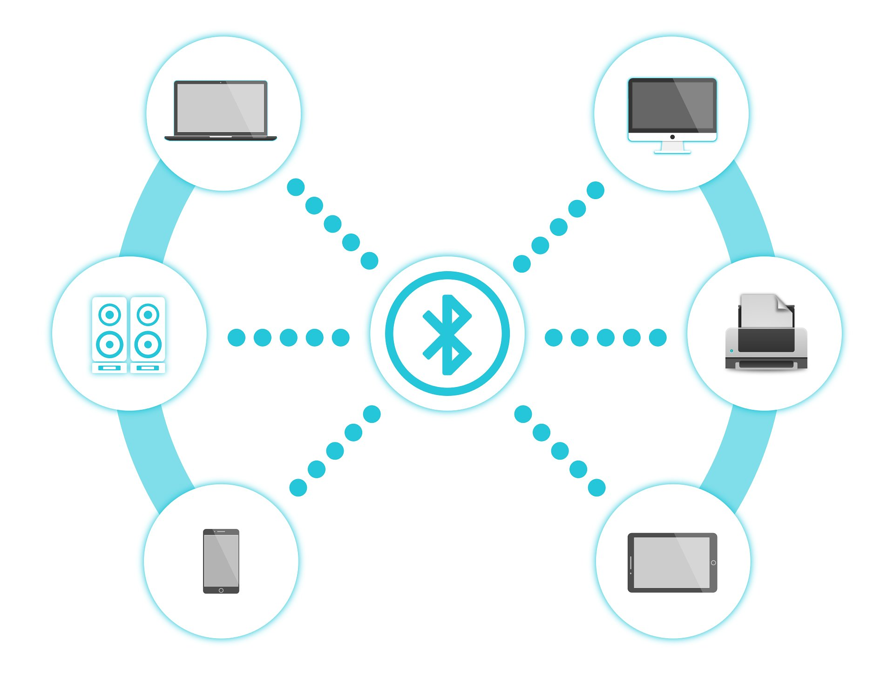
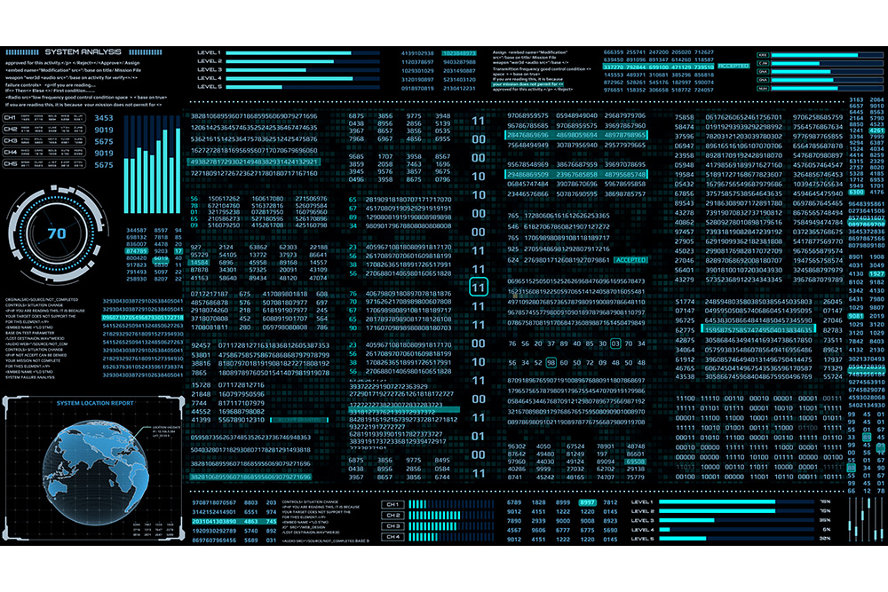

# M.Rifaldi Laiya

# Sinyal

## 1.Sinyal RF (Radio Frekuensi)

### Pengertian Sinyal RF (Radio Frekuensi)
Sinyal RF merupakan gelombang elektromagnetik yang digunakan oleh sistem komunikasi untuk mengirim informasi melalui udara dari satu titik ke titik lain,
Yang merambat antara antena pemancar dan antena penerima.Radio Frekuensi mempunyai 2 perangkat elektronik untuk mengirimkan sinyal gelombang elektromagnetik yang terdapat pada perangkat transmitter dan kemudian untuk menerima sinyal gelombang elektromagnetik tersebut yang terdapat pada perangkat receiver.
### Sifat-Sifat Sinyal RF (Radio Frekuensi)
Sinyal RF merambat di antara antena pemancar pengirim dan penerima.Sinyal yang dipasok pada antena memiliki amplitudo, frekuensi, dan interval. Sifat-sifat tersebut berubah-ubah setiap saat untuk merepresentasikan informasi.
Amplitudo mengindikasikan kekuatan sinyal,Jika jarak antara pengirim dan penerima bertambah, amplitudo sinyal menurun secara eksponensial.Oleh karena itu, sinyal harus memiliki cukup energi untuk mencapai jarak di mana tingkat sinyal bisa diterima sesuai yang dibutuhkan receiver.Frekuensi menyatakan beberapa kali sinyal berulang setiap detiknya. Satuan frekuensi adalah Hertz (Hz) yang merupakan jumlah siklus yang muncul setiap detik. Sebagai contoh, LAN nirkabel 802.11 beroperasi pada frekuensi 2,4 GHz yang berarti mencakup 2.400.000.000 siklus per detik. Interval berkaitan dengan seberapa jauh suatu sinyal tetap konstan pada titik acuan.

## 2.Infrared
infrared atau yang biasa kita kenal dengan inframerah adalah radiasi elektromagnetik yang memiliki panjang gelombang antara 700nm hingga 1mm.gelombang ini dapat digunakan sebagai media transmisi jarak dekat karena sifatnya yang tidak bisa menembus bangunan dan rentan terhadap gelombang elektromagnetik lain. Infrared berada pada frekuensi 300GHZ hingga 400THz.

ada 3 jenis infrared, ini dibagi berdasarkan panjang gelombangnya, diataranya:

1.Inframerah jarak dekat dengan panjang gelombang 0.75 – 1.5 µm
2.Inframerah jarak menengah dengan panjang gelombang 1.50 – 10 µm
3.Inframerah jarak jauh dengan panjang gelombang 10 – 100 µm

## 3.Bluetooth

Bluetooth adalah sebuah teknologi komunikasi wireless atau tanpa kabel yang beroperasi dalam pita frekuensi 2,4 GHz (antara 2.402 GHz s/d 2.480 GHz) dengan menggunakan sebuah frequency hopping tranceiver yang mapu menyediakan layanan komunikasi data dan juga suara secara real-time antara host-host bluetooth dengan jarak jangkauan layanan yang terbatas.
Sistem bluetooth terdiri atas: sebuah radio transceiver, baseband link Management dan Control, Baseband (processor core, SRAM, UART, PCM USB Interface), flash dan voice codec.

# 2.Encoding

Encoding adalah proses mengubah pikiran menjadi komunikasi. Encoder menggunakan ‘media’ untuk mengirim pesan, panggilan telepon, email, pesan teks, pertemuan tatap muka, atau alat komunikasi lainnya. Tingkat pemikiran sadar yang masuk kepesan penyandian dapat bervariasi.
Tujuan Encoding adalah mengubah data yang dapat digunakan oleh berbagai macam sistim secara tepat dan aman. Seperti mengirimkan data yang berbentuk biner lewat email (seperti attachment), menyimpan data biner ke dalam database atau menampilkan karakter-karakter special pada halaman web atau media lainnya. Biasanya data itu diterjemahkan kedalam karakter sesuai dengan tipe yang digunakan.

